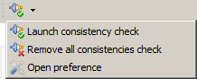
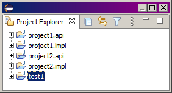
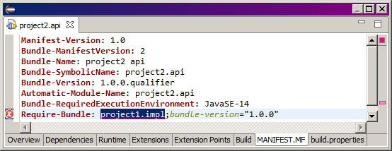

# Plugin consistency
Plugin consistency v2.x.x

## Installation
```
https://raw.githubusercontent.com/cylagarde/Plugin-Consistency/master/cl.plugin.consistency.update_site
```

## Introduction
Le plugin propose de vérifier si un plugin a le droit d'avoir un autre plugin comme dépendance.<br>
Par exemple, si vous avez 1 plugin qui définit des interfaces d'API et un autre plugin qui définit les implémentations des API, alors vous pouvez ne pas autoriser le plugin qui définit l'API à dépendre du plugin qui définit les implémentations.<br>

## Présentation
Le plugin affiche un button dans la barre d'outil principale avec 3 actions:<br>
<br>
* <b>Launch consistency check</b> : Lancement de la vérification des règles sur la consistence des plugins de votre workspace. La détection des incohérences sera affichée sous forme de markers dans la vue "Problems' d'Eclipse.
* <b>Remove all consistencies check</b> : Effacement des markers trouvés dans l'action prédédente.
* <b>Open preference</b> : Ouverture de la préférence pour définir les règles de détection des incohérences. La préférence se trouve sous Window/Preferences/Plug-in Development/Plugin Consistency.

## Types Preference
Cette vue permet de définir un type de plugin.<br>
<br>
Ici, 4 types sont définis:
* API: le type pour les plugins qui définit les interfaces d'API.
* IMPLEMENTATION: le type pour les plugins qui définit les implémentations.
* PROJECT 1: le type pour les plugins concernant le project 1.
* PROJECT 2: le type pour les plugins concernant le project 2.<br>

L'édition permet juste de donner un nom signification pour le type ainsi qu'une description détaillée.<br>
<br>

## Patterns Preference
Cette vue permet de définir un pattern de plugin.<br>
<br>
Ici, 4 patterns sont définis:
* la 1ère ligne indique que tous les plugins respectant le pattern "*.api" auront le type API et qu'ils ne pourront pas utiliser les plugins de type IMPLEMENTATION dans leurs dépendances.
* la 2éme ligne indique que tous les plugins respectant le pattern "*.impl" auront le type IMPLEMENTATION.
* la 3éme ligne indique que tous les plugins respectant le pattern "project1.*" auront le type PROJECT1 et qu'ils ne pourront pas utiliser les plugins de type PROJECT2 dans leurs dépendances.
* la 4éme ligne indique que tous les plugins respectant le pattern "project2.*" auront le type PROJECT1 et qu'ils ne pourront pas utiliser les plugins de type PROJECT1 dans leurs dépendances.

L'édition d'un pattern permet d'indiquer un ensemble de plugins avec une expression régulière pour lui associer un type définit dans la vue précédente.<br>
<br>

## Plugins Preference
Cette vue est la plus importante, c'est elle qui définit les règles pour détecter les incohérences.<br>
<br>


## Workspace
Ici mon workspace constitué de 2 projets distinct, chaque projet définit un plugin de définition des interfaces d'API et un plugin d'implémentation des interfaces.<br>
<br>

Dans le manifest du projet2 api, j'ai rajouté par erreur une dépendance sur l'implémentation du projet 1.<br> 
<br>

Dans le manifest du projet2 impl, j'ai rajouté par erreur une dépendance sur la définition d'interface du projet 1.<br> 
<br>

Un clic sur le bouton permet de lancer une vérification des incohérences.<br>
<br>
<br>

## Problems view
La vue "Problems' d'Eclipse permet d'afficher les incohérences détectées dans les plugins du workspace.<br>
<br>
<br>
Un double clic sur une ligne ouvre le fichier MANIFEST.MF pour voir l'erreur.<br>
<br>
